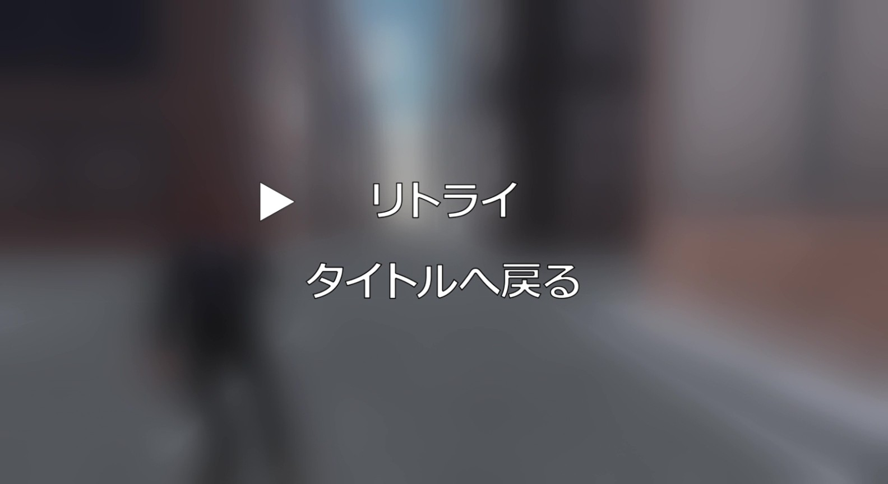
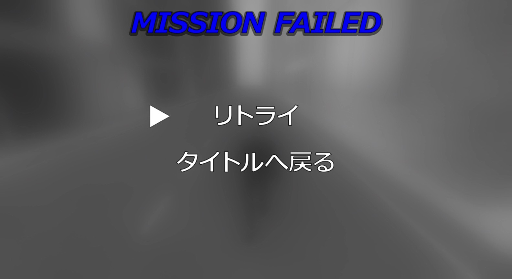
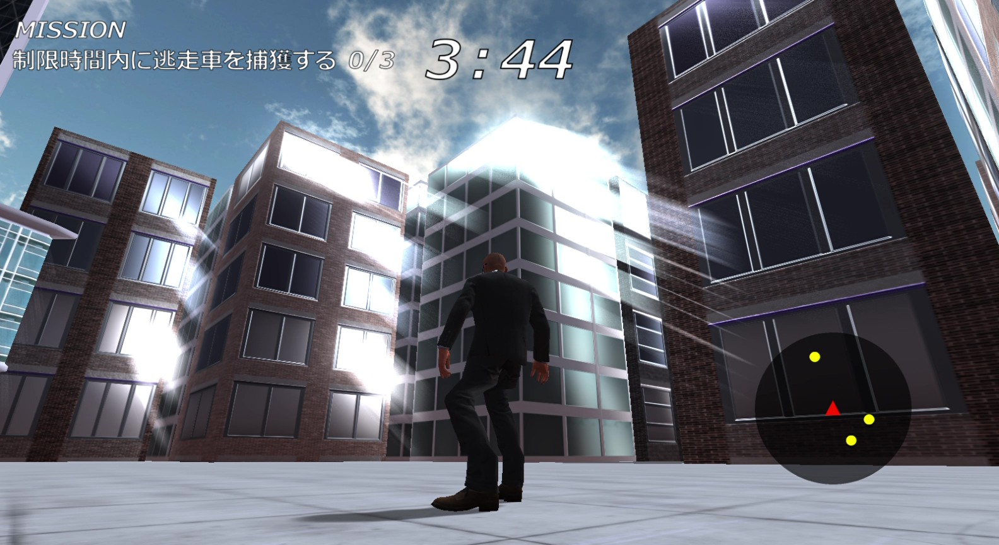

# City Pursuit

### 作成者
> 河原電子ビジネス専門学校 ゲームクリエイター科 谷本優樹 
>
>メールアドレス
>ca01244016@st.kawahara.ac.jp 

## 目次
> - [1.作品概要](#1作品概要)
> - [2.操作方法](#2操作方法)
> - [3.担当ソースコード](#3担当ソースコード)
> - [技術紹介](#技術紹介)
>   - [4.ワイヤーアクション](#4ワイヤーアクション)
>   - [5.ゲームクリア・オーバー時のポストエフェクト](#5ゲームクリア・オーバー時のポストエフェクト)
>   - [6.カメラの視錐台を用いた当たり判定](#6カメラの視錐台を用いた当たり判定)
>   - [7.ゴッドレイ](#7ゴッドレイ)
> - [こだわったこと](#こだわったこと)
>   - [8.爽快感のあるワイヤーアクションの工夫](#8爽快感のあるワイヤーアクションの工夫)
>   - [9.ゲーム内の演出](#9ゲーム内の演出)

## 1.作品概要
> * ゲームジャンル
>   * ワイヤーアクションゲーム
> * ゲーム内容
>   * 制限時間内に都市内に逃走している車をワイヤーアクションを駆使してすべて捕獲するゲーム
> * プレイ人数
>   * 1人
> * 対応コントローラー
>   * Xbox 360 コントローラー
> * 使用ツール
>   * プログラム
>       * Visual Studio 2022
>   * 3Dモデル
>       * 3ds Max 2025
>   * 画像
>      * Adobe Photoshop 2024
>   * エフェクト
>       * Effeckseer
>   * バージョン管理
>       * GitHub
>       * Fork
>   * タスク管理
>       * Notion
> * 使用言語
>   * C++, HLSL
> * 開発環境
>   * Windows11
>   * 学校内製の簡易ゲームエンジン(DirectX12)
> * 開発期間
>   * 2025年9月~現在
> * 制作人数
>   * 1人
> * リンク
>   * GitHub <a href="https://github.com/TanimotoYuuki/CityPursuit" target="_blank"> https://github.com/TanimotoYuuki/CityPursuit </a>
>   * Youtube <a href="https://youtu.be/Fw3jPplzXHA" target="_blank"> https://youtu.be/Fw3jPplzXHA </a>
>
> [目次へ戻る](#目次)

## 2.操作方法
> Aボタン: ジャンプ 
> Yボタン: (車の近くで) 車の上に乗る 
> Lスティック: 移動 
> R2ボタン(長押し): (地上で) ダッシュ、(空中で) ワイヤーアクション  
> [目次へ戻る](#目次)

## 3.担当ソースコード

ソースコード(.cpp .h)

> ### ゲーム
> * Buildings
>   * Buildings.h
> * DebugLog.cpp
>   * DebugLog.h
> * Enemy.cpp
>   * Enemy.h
> * EnemyAI.cpp
>   * EnemyAI.h
> * EnemyEffect.cpp
>   * EnemyEffect.h
> * FadeManager.cpp
>   * FadeManager.h
> * FirstEnemyDirection.cpp
>   * FirstEnemyDirection.h
> * Game.cpp
>   * Game.h
> * GameBackGround.cpp
>   * GameBackGround.h
> * GameClear.cpp
>   * GameClear.h
> * GameClearCamera.cpp
>   * GameClearCamera.h
> * GameClearSprite.cpp
>   * GameClearSprite.h
> * GameEndSelect.cpp
>   * GameEndSelect.h
> * GameMission.cpp
>   * GameMission.h
> * GameOver.cpp
>   * GameOver.h
> * GameOverSprite.cpp
>   * GameOverSprite.h
> * GameResult.cpp
>   * GameResult.h
> * GameStartSprite.cpp
>   * GameStartSprite.h
> * GameTimeLimit.cpp
>   * GameTimeLimit.h
> * InvisibleWall.cpp
>   * InvisibleWall.h
> * Loading.cpp
>   * Loading.h
> * main.cpp
> * MiniMap.cpp
>   * MiniMap.h
> * Player.cpp
>   * Player.h
> * PlayerAnimation.cpp
>   * PlayerAnimation.h
> * PlayerCamera.cpp
>   * PlayerCamera.h
> * PlayerCatchEnemy.cpp
>   * PlayerCatchEnemy.h
> * PlayerEffect.cpp
>   * PlayerEffect.h
> * PlayerJump.cpp
>   * PlayerJump.h
> * PlayerMove.cpp
>   * PlayerMove.h
> * PlayerRotation.cpp
>   * PlayerRotation.h
> * PlayerSwingAction.cpp
>   * PlayerSwingAction.h
> * QteEvent.cpp
>   * QteEvent.h
> * QteEventInput.cpp
>   * QteEventInput.h
> * SceneManager.cpp
>   * SceneManager.h
> * SpriteAnimation.cpp
>   * SpriteAnimation.h
> * Street.cpp
>   * Street.h
> * SwingActionManager.cpp
>   * SwingActionManager.h
> * SwingModel.cpp
>   * SwingModel.h
> * SwingTarget.cpp
>   * SwingTarget.h
> * Title.cpp
>   * Title.h
> * TitleBackGround.cpp
>   * TitleBackGround.h
> * TitleCamera.cpp
>   * TitleCamera.h
> * TitleSelect.cpp
>   * TitleSelect.h
> * TitleSprite.cpp
>   * TitleSprite.h

> ### エンジン
> * CameraCollisionSolver.cpp
>   * CameraCollisionSolver.h
> * GameEndPostEffect.cpp
>   * GameEndPostEffect.h
> * GodRay.cpp
>   * GodRay.h
> * SpringCamera.cpp
>   * SpringCamera.h
> * ViewFrustum.cpp
>   * ViewFrustum.h

ソースコード(.fx)

> * bloom.fx
> * GameEndPostEffect.fx
> * GodRay.fx

[目次へ戻る](#目次)

# 技術紹介
## 4.ワイヤーアクション
>  
> ### 1.物理法則に基づく振り子の挙動の実装
> このゲームの核でもあるワイヤーアクションの「重み」と「加速感」を表現するために、振り子の原理を応用した物理計算を実装しました。 
>
> * 振り子の原理の応用: 単調な移動ではなく、振り子の最下点で最大速度となり、上昇するにつれて減速する挙動を下記の数式を用いて再現しました。 
>数式: $v = \sqrt{2gl(\cos\theta - \cos\theta_{top})}$  
>これにより、重力に引っ張られるリアルな加速感を生み出しています。 
>
> * 動的な重力係数の調整: プレイヤーの初期速度や落下速度に応じて重力加速度(G)を動的に変化させることで、高所からの落下時にワイヤーを繋いだ際の「急激な重力加速度」や、初速が足りない場合の挙動を自然に見せる調整を行っています。
>
> ### 2.快適なプレイを実現するターゲット検索アルゴリズム
> 広大な都市で、プレイヤーが「狙った場所」にストレスなくワイヤーを掛けられるよう、独自のターゲット検索システムを構築しました。 
>
> * AABB表面へのターゲット動的生成: ビルのAABBから、表面、後面、側面に対して一定間隔でターゲット座標を計算し、コンテナに保持させています。これにより、手動でポイントを配置することなく、建物のあらゆる壁面をワイヤー対象として認識させることを可能にしました。 
>
>
> * 最適なターゲットの選出ロジック:プレイヤーの前方ベクトルとターゲットへの内積計算を用い、視界内かつ距離が近い最適なポイントを毎フレーム検索しています。さらに、プレイヤーの背後にあるターゲットを除外するフィルタリングを行うことで、意図しない場所への誤作動を防いでいます。 
>
> [目次へ戻る](#目次)

## 5.ゲームクリア・オーバー時のポストエフェクト
> ・ゲームクリア時のポストエフェクト 
>
> ・ゲームオーバー時のポストエフェクト 
> 
>
> ### 1.実装目的
> ゲームの終了条件(クリア・オーバー)に応じて画面の雰囲気をリアルタイムに変化させ、プレイヤーに直感的なフィードバックを与えるポストエフェクトを実装しました。
> * ゲームクリア時(ガウシアンブラー) :背景をぼかすことで情報の優先度を下げ、画面に表示されるUIに視線を誘導します。
>
> * ゲームオーバー時(モノクロ化＋ガウシアンブラー) :ブラーによる視線誘導に加え、画面の色味を抜くことで「失敗」「停止」といったネガティブなフィードバックを視覚的に強調し、没入感を損なわずリトライへの動線を提示しています。
>
> ### 2.効率的なレンダリングパイプライン
> 複数のポストエフェクトを効率よく管理するため、以下の設計を行いました。
> * 定数バッファによる動的制御: C++側から drawingPostEffect フラグを定数バッファとして送信することで、シェーダーを切り替えることなく、if分岐によって「ブラーのみ」「ブラー＋モノクロ」の処理を動的に切り替えています。
>
> * イージングによるシームレスな遷移: drawingRate（0.0～1.0）というパラメータを毎フレーム更新し、lerp 関数で元のシーン画像とエフェクト画像を線形補間しています。これにより、パッと画面が切り替わるのではなく、徐々に視界が変化する滑らかな演出を実現しました。
>
> * 多段階レンダリング: シーンのキャプチャ → ガウシアンブラー処理（GPU） → モノクロ合成 → 最終出力というパスを構築し、レンダリングターゲットを使い回すことでメモリ効率を意識しました。
>
> [目次へ戻る](#目次)

## 6.カメラの視錐台を用いた当たり判定
> 
>
> ### 1.実装目的
> ゲーム内演出において「プレイヤーが敵を初めて発見した瞬間」を正しく判定するために実装しました。単にプレイヤーとの距離だけで判定すると、背後の敵や壁の向こう側の敵にも反応しまうため「カメラの視界内に存在する」かつ「遮蔽物に隠れていないか」を厳密に判定する必要がありました。 
>
> ### 2.ビュープロジェクション行列から視錐台抽出
> カメラの視界両駅を表す6枚の平面(近・遠・上下左右)を、カメラのビュープロジェクション行列から直接抽出して計算しています。 
> * 行列から平面導入: ビュープロジェクション行列の各成分を合成することで、ワールド行列における6つの平面方程式（ $Ax + By + Cz + D = 0$ ）を毎フレーム算出します。各平面は法線ベクトルを正規化し、正確な距離判定が行える状態に更新します。 
>
> ### 3.平面と球の交差判定によるカリング
> 判定対象（敵キャラクター）に対してバウンディングスフィア（境界球）を設定し、視錐台の6枚の平面すべてに対して「内側にあるか」を判定します。
>
> * 点と平面の距離計算: 平面の法線ベクトルと座標の内積を用いて、球の中心が平面の「表」にあるか「裏」にあるかを判定します。計算式(normal.Dot(center) + distance < -radius) を用いることで、球体が完全に平面の外側にある場合のみfalseを返すフィルタリングを実現しました。
>
> ### 4.レイキャストを併用した厳密な遮蔽判定
> 視錐台の判定のみだと、「壁の裏に敵」も「視界内」として判定してしまいます。そこで、視錐台の判定を通過したオブジェクトに対してのみ、物理エンジンによるレイキャストを実行する2段階構成にしました。
> * 処理負荷の最適化: 重い処理であるレイキャストの実行処理を視錐台カリングによって事前に軽減することで、パフォーマンスを維持しつつ、「壁越しには反応しない」という正確なゲームプレイ判定を実現しています。
>
> [目次へ戻る](#目次)

## 7.ゴッドレイ
>  
>
> ### 1.実装目的
> 都市のビル群から差し込む光の筋を表現するため、ポストエフェクトによるゴッドレイを実装しました。
>
> ### 2.既存技術の応用によるボリューム表現
> 通常は疾走化の演出などに用いられる「ズームブラー」のアルゴリズムを応用し、低負荷なゴッドレイしました。光源(太陽)の位置をブラーの中心点として設定し、高輝度部分のみを画面の外側へ引き延ばすようにサンプリングすることで、大気中に光が散乱しているような「疑似的なボリュームライト表現」を実現しています。
> 
> [目次へ戻る](#目次)

# こだわったこと
## 8.爽快感のあるワイヤーアクションの工夫
> ### 1.カメラの減衰処理 
> カメラに何も工夫せずに追従するとワイヤーアクションの加速感が感じられない挙動になるため、カメラに減衰を持たせて追従することで加速感を感じることができ、ワイヤーアクション特有の爽快感を実現することができました。
> 
> ### 2.画面周りに集中線のエフェクトの描画 
> ワイヤーアクション中に画面周りに集中線のエフェクトを描画することで加速感を視覚的に表現することができました。
>
> [目次へ戻る](#目次)

## 9.ゲーム内の演出
> * ### 1.初めてプレイヤーが敵を捕捉したときの演出 
>   * このゲームを初めてプレイする人は敵はどれなのか分からないため 画面内に初めて敵を捕捉したらカメラを敵の方にズームインして UIを表示すれば敵だと認識することができます。
>
> * ### 2.QTEイベント結果の演出シーン
>   * #### 成功シーン 
>       * 「逃走車が近くのビルに衝突させてから派手に爆発すること」で 逃走車を捕獲したという達成感を強調しています。
>
>   * #### 失敗シーン 
>       * 「車が急加速し、プレイヤーを振り落とす」の挙動を入れることで、QTEイベントに失敗した悔しさと逃走車が逃げられた状況を直感的に伝えています。
>
> * ### 3.ゲームクリア演出 
>   * スコア表示をアニメーション化して、プレイヤーの達成感を最大化させています。
>
> * ### 4.ゲームオーバー演出 
>   * 「画面全体をモノクロ化」するポストエフェクトをかけて、 視覚的に「失敗した」ことが瞬時に伝わるようにしました。 UIだけでなく、画面全体の色味で状況を伝える工夫をしています。
>
> [目次へ戻る](#目次)